# Pari Portfolio

A high-performance, feature-rich developer portfolio built to showcase personal projects, technical experience, and real-time coding achievements. This project integrates a suite of modern technologies to create a dynamic, AI-enhanced visitor experience with a robust backend management system.

---

## 🚀 Overview

This portfolio serves as more than just a static bio. It is a live dashboard of my engineering journey, featuring real-time statistics synchronization from top coding platforms, a custom-built analytics engine, and an AI-powered chatbot to assist recruiters and visitors.

🌐 **Live Demo:** https://pari-portfolio.web.app

---

## ✨ Features

- 🤖 Gemini AI-powered portfolio assistant
- 📊 Real-time coding profile synchronization
- 🔥 Contribution heatmaps & analytics dashboards
- 🔐 Secure admin dashboard with Google Authentication
- 📄 Resume preview & PDF management
- 📬 Contact & inbox automation system
- 🌙 Multiple interactive themes and animations
- 📱 Fully responsive across desktop, tablet, and mobile
- ☁️ Firebase-powered real-time backend architecture

---

## 🛠️ Tech Stack Flow

### Frontend
- React.js
- TypeScript
- Vite
- Tailwind CSS
- Framer Motion
- Recharts / Chart.js

### Backend & Services
- Node.js + Express

### Database & Auth
- Firebase Firestore
- Firebase Authentication
- Firebase Analytics

### APIs & Integrations
- GitHub API
- LeetCode APIs
- Codeforces APIs
- Google Gemini API

### Utilities & Tools
- Git & GitHub
- PDF.js (Live resume preview)
- REST APIs
- Firebase Hosting
- EmailJS (Contact form)
- Google Apps Script (Sheet sync backup)

---

## 📸 Screenshots

| 🏠 Home — Light Theme | 🌑 Home — Dark Theme |
|---|---|
| 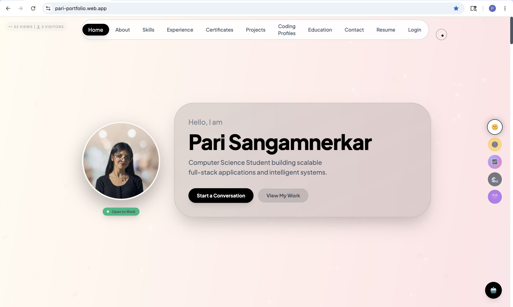 | 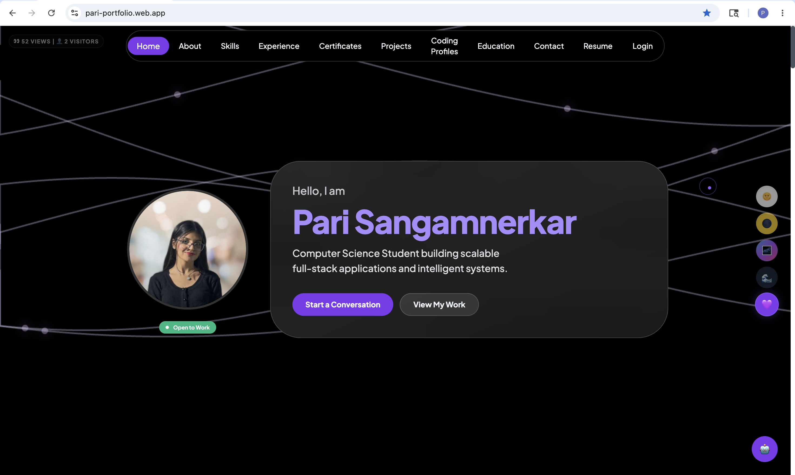 |

| 👩‍💻 About Section | 🛠️ Skills Dashboard |
|---|---|
| 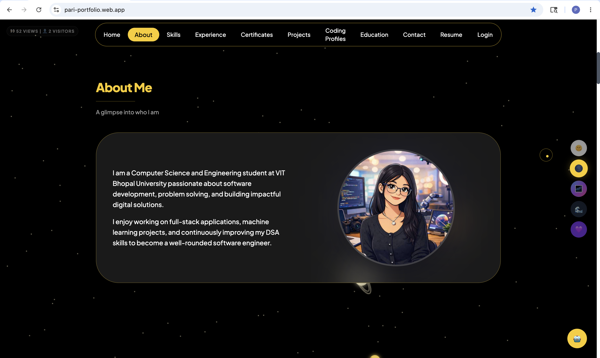 | 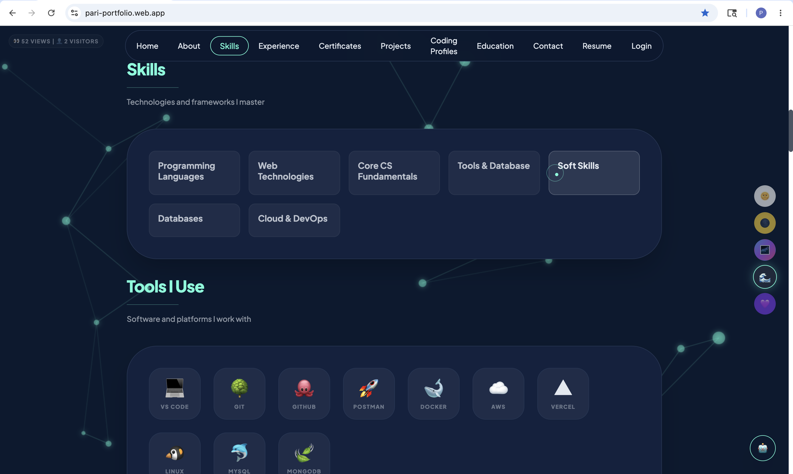 |

| 🚀 Projects Showcase | 📊 Live Coding Profiles & Sync |
|---|---|
| 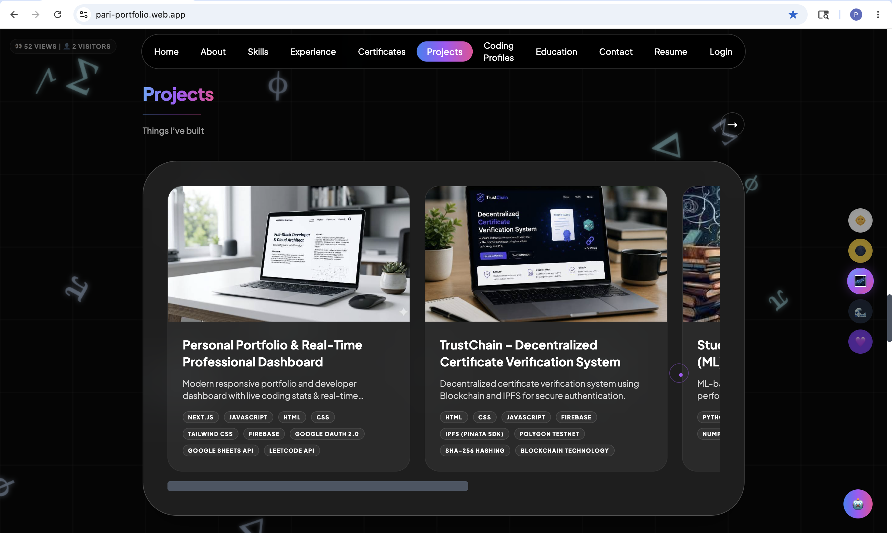 | 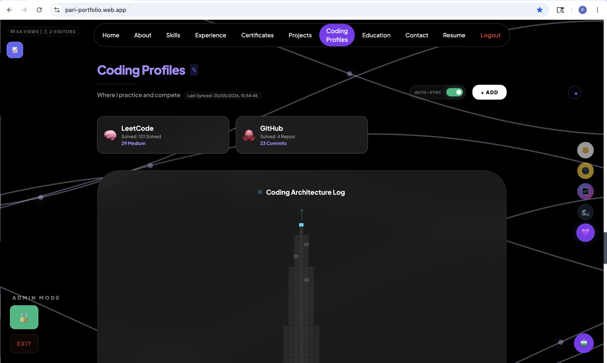 |

| 📈 Real-Time Coding Architecture Graph | 🔥 Consistency Contribution Heatmap |
|---|---|
| 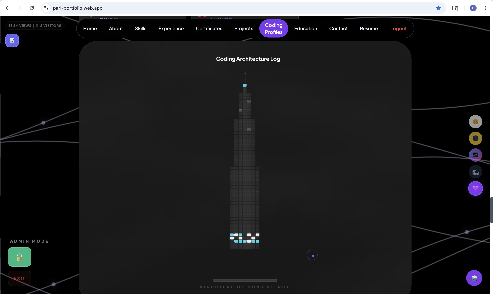 | 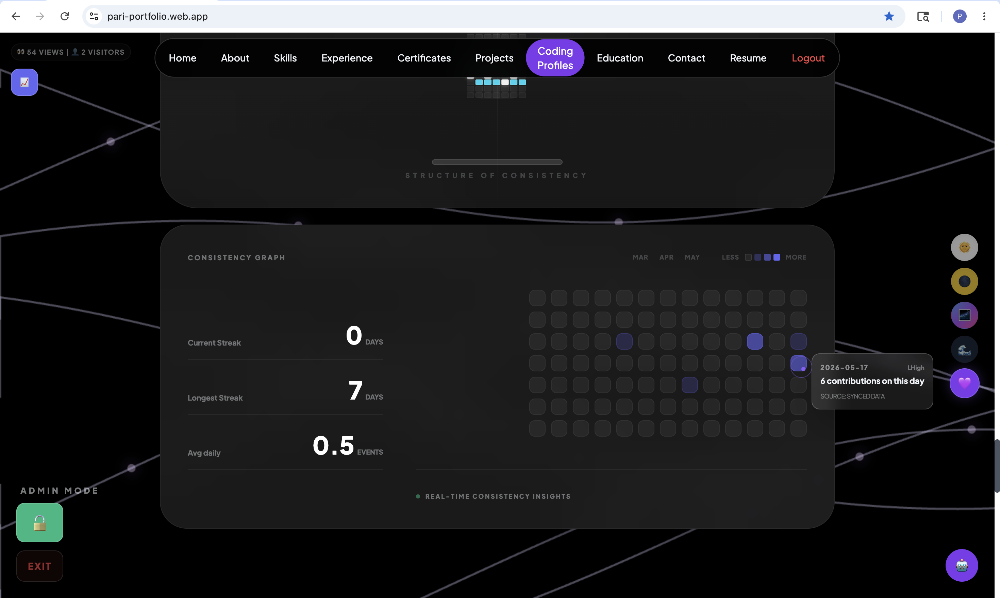 |

| 📄 Resume Management | 📡 Real-Time Analytics Dashboard |
|---|---|
| 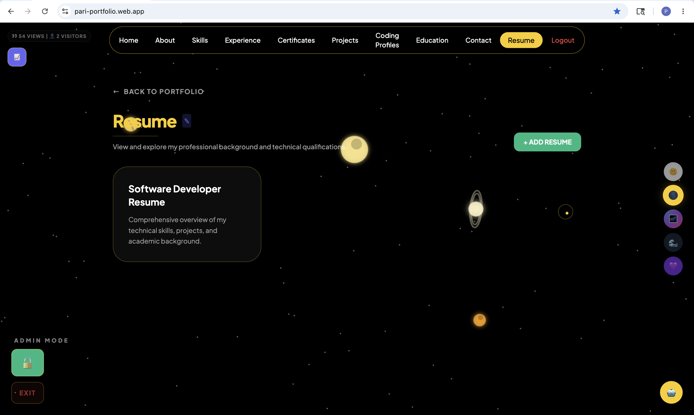 | 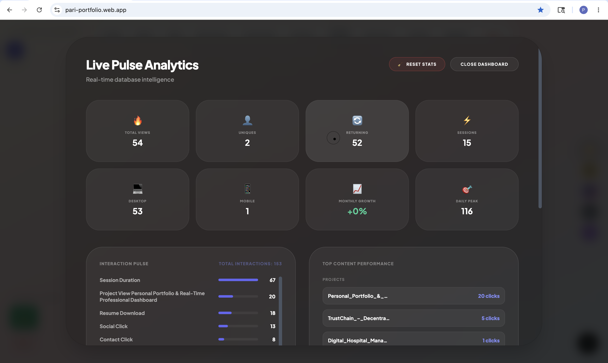 |

| 📊 Interaction & Visitor Insights | 📬 Contact & Social Integration |
|---|---|
| 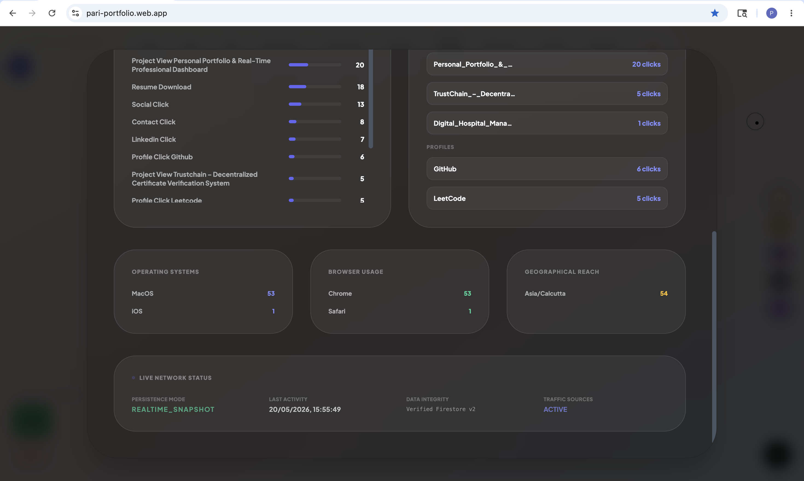 | 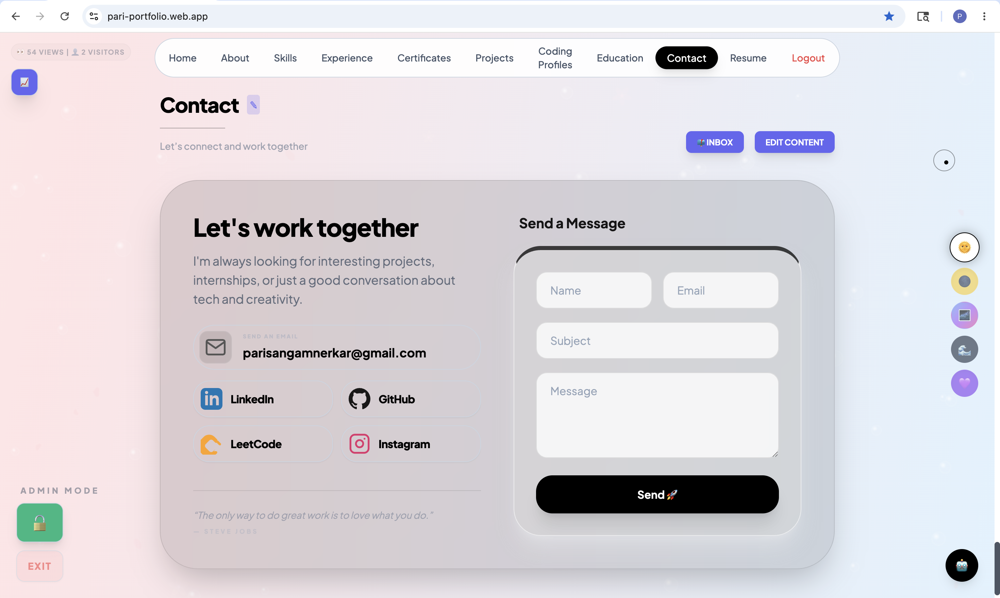 |

| 🤖 AI Chatbot Assistant | 🔐 Admin Portal |
|---|---|
| 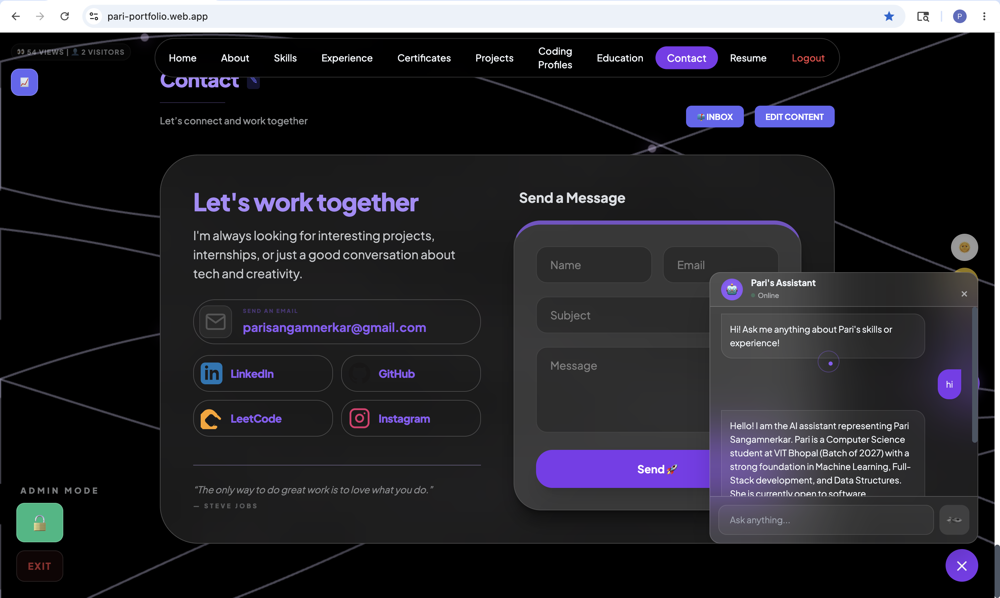 | 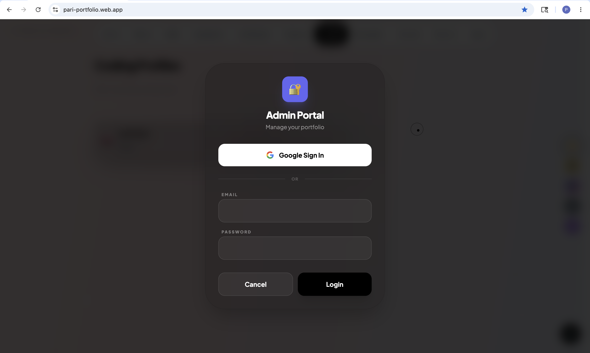 |

---

## 🏗️ Architecture Highlights

- Firebase Firestore used as a live CMS for portfolio content
- Gemini AI assistant integrated with contextual portfolio awareness
- Real-time coding statistics aggregation and sync system
- Admin-controlled analytics dashboard with visitor tracking
- Secure environment-variable-based configuration
- Modular component structure for scalability and maintainability
- Optimized lazy-loading for media-heavy sections and PDF previews

---

## 📁 Project Structure

```text
pari-portfolio/
│
├── components/                 # UI sections & reusable components
├── hooks/                      # Custom React hooks
├── public/                     # Static assets
├── README-assets/              # README screenshots
│
├── analyticsService.ts         # Analytics & tracking logic
├── geminiService.ts            # Gemini AI configuration
├── googleAppsScript.gs         # Spreadsheet sync automation
│
├── firebase.json               # Firebase hosting config
├── firestore.rules             # Firestore security rules
│
├── App.tsx                     # Main application
├── index.tsx                   # Firebase initialization
├── server.ts                   # Express/Vite server
│
├── package.json
├── tsconfig.json
└── vite.config.ts
```

---

## ⚙️ Setup & Installation

### Prerequisites
- Node.js 20+
- Firebase Project Configuration
- Google Gemini API Key (for Chatbot)
 
---

## ⚙️ Local Setup

### 1️⃣ Clone Repository

```bash
git clone https://github.com/pari-28/pari-portfolio.git
cd pari-portfolio
```

---

### 2️⃣ Install Dependencies

```bash
npm install
```

---

### 3️⃣ Configure Environment Variables

Create a `.env` file in the root directory:

```env
# Firebase Configuration
VITE_FIREBASE_API_KEY=your_api_key
VITE_FIREBASE_AUTH_DOMAIN=your_project.firebaseapp.com
VITE_FIREBASE_PROJECT_ID=your_project_id
VITE_FIREBASE_STORAGE_BUCKET=your_project.appspot.com
VITE_FIREBASE_MESSAGING_SENDER_ID=your_sender_id
VITE_FIREBASE_APP_ID=your_app_id
VITE_FIREBASE_MEASUREMENT_ID=your_measurement_id

# Gemini AI
GEMINI_API_KEY=your_gemini_api_key

# Admin Email
VITE_ADMIN_EMAIL=your_email@gmail.com
```

---

### 4️⃣ Start Development Server

```bash
npm run dev
```

---

## 🚀 Deployment

Build the project:

```bash
npm run build
```

Deploy using Firebase:

```bash
firebase deploy
```

---

## 🔒 Security

- Sensitive credentials managed through environment variables
- Firestore rules restrict write access to authenticated admin users
- No private API keys exposed in the public repository
- Public Firebase configuration separated from secret credentials

---

## 📈 Future Improvements

- Automated coding stats cron sync
- Expanded competitive programming platform integrations
- Theme persistence enhancements
- Advanced recruiter analytics insights

---

## 📄 License

This project is intended for personal portfolio and educational purposes. Feel free to use the code as inspiration, but please credit the original work.

---

# 👩‍💻 Author

*Built with ❤️ by **Pari Sangamnerkar**.*

- Portfolio: https://pari-portfolio.web.app
- GitHub: https://github.com/pari-28
- LinkedIn: https://www.linkedin.com/in/pari-sangamnerkar-ab356038b/


